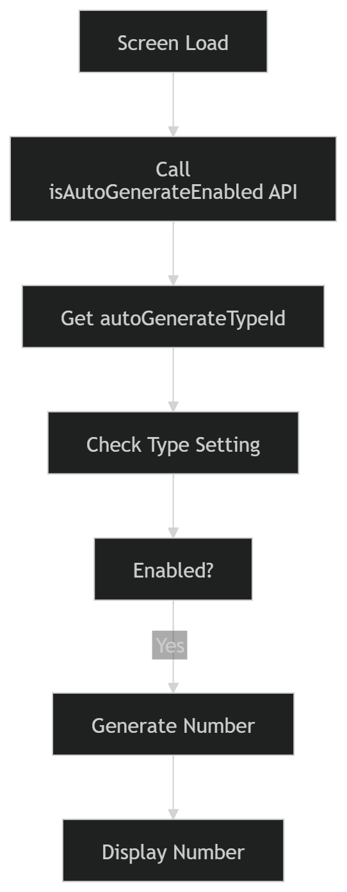
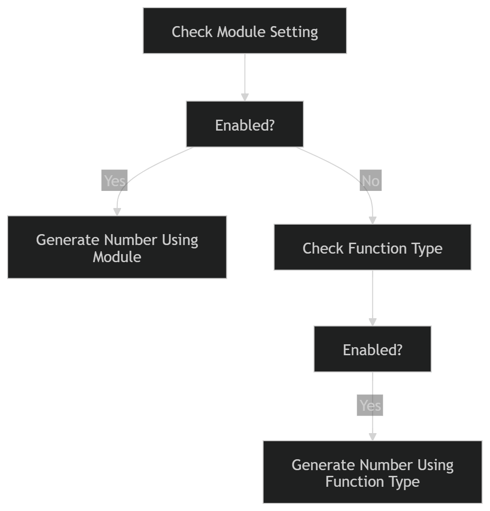
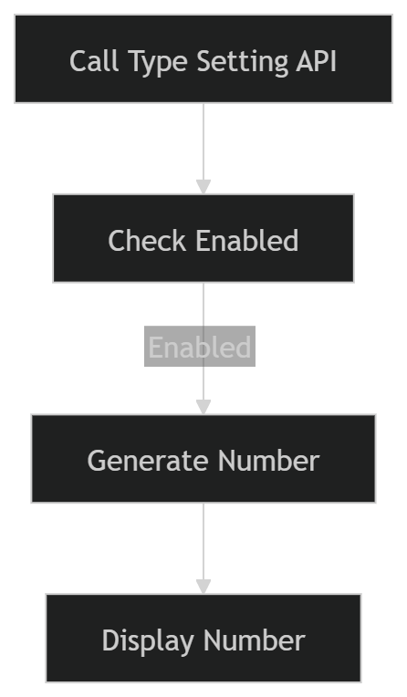

# Auto-Generate Number Management

## 1. Overview

The Auto-Generate Number Management module is responsible for generating unique transaction numbers across different modules in the system.

### The module supports:
1. Module-based auto-generation
2. Module-based auto generation with Function Type fallback
3. Function Type-based auto-generation

### The generated number consists of:
`Prefix + Running Sequence Number + Suffix`

**Example:**
- PO-000001
- INV-2025-000123
- DC-000456-A

---

# 2. Database Design

## 2.1 Auto-Generate Module Settings

**Table: autogeneratemodulesettings**

| Column | Description |
|----------|------------|
| id | Primary Key |
| autoGenerateTypeId | Reference to Auto-Generate Type Settings |
| module | Module Name |
| entityType | Entity Type |
| entityId | Entity Identifier |

### Purpose
Maps a Module + Entity combination to a specific Auto-Generate Type.

### Example

| module | entityType | entityId | autoGenerateTypeId |
|----------|----------|----------|----------|
| OUTWARD_DC | PICKUP_LOCATION | A | 1 |
| OUTWARD_DC | PICKUP_LOCATION | B | 2 |

## 2.2 Auto-Generate Type Settings

**Table: autogeneratetypesettings**

| Column | Description |
|----------|------------|
| id | Primary Key |
| functionType | Function Identifier |
| prefix | Number Prefix |
| suffix | Number Suffix |
| paddingNumber | Sequence Padding |
| maxLength | Maximum Length |
| isAutoGenerateEnabled | Auto-Generate Enabled |

### Purpose
Stores generation rules.

### Example

| id | functionType | prefix | padding |
|----|--------------|--------|---------|
| 1 | OUTWARD_DC_A | AAA | 6 |
| 2 | OUTWARD_DC_B | BBB | 6 |
| 3 | PO | PO | 6 |

## 2.3 Auto-Generate Sequence

**Table: autogeneratesequence**

| Column | Description |
|----------|------------|
| id | Primary Key |
| autoGenerateTypeId | Reference to Type Setting |
| series | Generated Series |
| maxNumber | Last Used Sequence |

### Purpose
Stores the latest generated sequence.

### Example

| autoGenerateTypeId | maxNumber |
|-------------------|-----------|
| 1 | 125 |
| 2 | 98 |

---

# 3. APIs

## Check Auto-Generate Enabled

**API**
`GET /auto-generate-module-settings/isAutoGenerateEnabled`

### Request

```json
{
  "module":"OUTWARD_DC",
  "entityType":"PICKUP_LOCATION",
  "entityId":"A"
}
```

or

```json
{
  "module":"OUTWARD_DC",
  "entityType":"PICKUP_LOCATION",
  "entityId":"A",
  "functionType":"OUTWARD_DC"
}
```

### Response

```json
{
  "isAutoGenerateEnabled": true
}
```

## Generate Number

**API**
`GET /auto-generate-sequence/max-number`

### Response

```json
{
  "generatedNumber":"AAA000126"
}
```

## Function Type Search

**API**
`GET /auto-generate-type-settings/search/true?functionType=PO`

### Response

```json
{
  "isAutoGenerateEnabled": true
}
```

---

# 4. Flow 1 - Module-Based Auto Generation

### Input
- Module
- entityType
- entityId

### Example
- OUTWARD_DC
- PICKUP_LOCATION
- A

## Frontend Flow
<p align="center">
  
</p>

### Steps
1. User opens transaction screen.
2. Frontend calls: `/auto-generate-module-settings/isAutoGenerateEnabled`
3. System searches: `autogeneratemodulesettings`
   - Using: module, entityType, entityId
4. Retrieve: autoGenerateTypeId
5. Load: autogeneratetypesettings
6. Check: isAutoGenerateEnabled
7. If enabled: Call `/auto-generate-sequence/max-number`
8. Generate a number.
   - Example: AAA000126
9. Display on screen.

## Backend Save Flow

Before saving transaction:

1. Ignore the frontend-generated number.
2. Regenerate number.
3. Lock sequence.
4. Fetch the latest maxNumber.
5. Increment.
6. Generate the final number.
7. Save transaction.
8. Update sequence table.

### Example
- Current Max Number = 125
- Generated = AAA000126
- Update maxNumber = 126

---

# 5. Flow 2 - Module-Based with Function Type Fallback

### Input
- module
- entityType
- entityId
- functionType

### Example
- OUTWARD_DC
- PICKUP_LOCATION
- A
- OUTWARD_DC

### Business Rule

Priority:

Module Configuration

↓

Function Type Configuration

## Frontend Flow
<p align="center">
  
</p>
### Scenario 1

- Module Setting Enabled
- Use module configuration
- Generate number.

**Example:** AAA000126

### Scenario 2

Module Setting Disabled

**Table:** autogeneratetypesettings

**Field to Check:** functionType

### Logic

- Check the functionType record in the autogeneratetypesettings table.
- If the auto-generation setting is enabled, generate the document number automatically.
- Number generation should follow the configured sequence without applying any custom module-specific settings.
- Example: DC000126

## Backend Save Flow

Same as Flow 1.

- Always regenerate before save.
- Never trust a frontend-generated number.

---

# 6. Flow 3 - Function Type Based Generation

### Input
- functionType

### Example
- PO

## Frontend Flow
<p align="center">
  
</p>

### Steps

1. Call: `/auto-generate-type-settings/search/true?functionType=PO`
2. Find configuration.
3. Check: isAutoGenerateEnabled
4. Generate a number.
5. Show number.

### Example

PO000126

## Backend Save Flow

1. Regenerate number.
2. Save transaction.
3. Update sequence.

---

# 7. Number Generation Logic

### Formula

Generated Number = Prefix + Sequence Number + Suffix

### Example Configuration

- Prefix = AAA
- Suffix = ''
- Padding = 6
- Current Max = 125

### Generated

- AAA000126

### Padding Logic

**Example**

- Padding: 6
- Number: 126
- Result: 000126

---

# 8. Concurrency Handling

### Problem

Two users generate numbers simultaneously.

### Example

- User A → AAA000126
- User B → AAA000126

Duplicate number risk.

### Solution

During Save:

Frontend Number → Preview Only

Backend must:

1. Start Transaction
2. Lock Sequence Record
3. Read Current Max
4. Increment
5. Save Transaction
6. Update Max Number
7. Commit

This guarantees uniqueness.

---

# 9. Error Handling

### Scenario

- Number generation failed.
- Example Pending-2345rft543
- Transaction saved.

### UI Behavior

- Display: Pending-2345rft543
- Show: Refresh Icon
- Near Number Field.

### Refresh Action

When the user clicks Refresh:

1. Call the generation API again.
2. Generate a new valid number.
3. Update transaction record.
4. Update sequence table.
5. Hide refresh icon.

### Example

Pending-2345rft543

↓

AAA000127

---

# 10. Validation Rules

### Validation 1

- Module setting not found
- Auto-Generate Configuration Not Found.

### Validation 2

- Type setting not found
- Auto-Generate Type Configuration Not Found.

### Validation 3

- Auto generation disabled
- Allow Manual Entry.

### Validation 4

- Prefix exceeds max length
- Generated Number exceeds the configured maximum length.

### Validation 5

- Sequence record missing
- Create a sequence record with maxNumber = 0.

---

# 11. Key Design Principles

1. The frontend-generated number is only a preview.
2. Backend must always regenerate before save.
3. Sequence update must happen inside a transaction.
4. Use row-level locking to avoid duplicate numbers.
5. Support module-level and function-level configurations.
6. Support fallback logic from module configuration to function type configuration.
7. Failed generations should be stored as Pending numbers and recoverable using the Refresh action.
8. The sequence table is the single source of truth for the next running number.

This design ensures unique, scalable, configurable, and concurrency-safe auto-generated transaction numbers across all modules.
